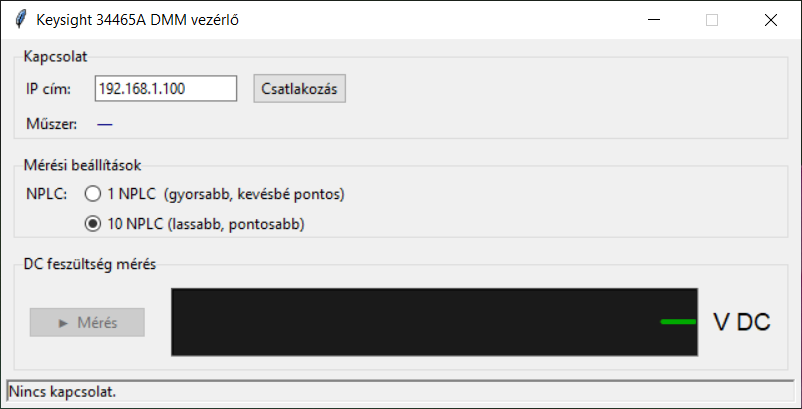

# DMM_34465A – Keysight 34465A multiméter vezérlő

Keysight 34465A digitális multiméter TCP SCPI vezérlő és GUI-ja. A program általános
mérési feladatokra is alkalmas, azonban elsődleges célja a **multiméter saját zajának
mérése és naplózása**: hosszú idősorozatot rögzít, amelyből a műszer zajteljesítménye,
drift-tulajdonságai és spektrális zajsűrűsége meghatározható.

A program más projektek által importált `DMM` osztályként is szolgál
(Cal_E3632A, PSU_E3632A, Cal_33511B, Spec_33511B).



## Funkciók

- DC/AC feszültség és árammérés
- Ellenállás mérés (2-wire / 4-wire)
- SCPI parancsos direkt vezérlés
- Hosszú idejű mérési sorozat naplózása CSV formátumba

## Mérési munkafolyamat – zajanalízis

A DMM_34465A által rögzített CSV fájl feldolgozása a következő lépésekben történik:

```
DMM_34465A  →  KS34465_Converter  →  HP3458A_Analyzer
 (mérés)        (formátum-átalakítás)   (zajspektrum elemzés)
```

| Lépés | Program | Szerep |
|-------|---------|--------|
| 1. Mérés | **DMM_34465A** | Idősorozat rögzítése CSV-be |
| 2. Átalakítás | **[KS34465_Converter](https://github.com/kvez/KS34465_Converter)** | CSV konvertálása az Analyzer formátumára |
| 3. Elemzés | **[HP3458A_Analyzer](https://github.com/kvez/HP3458A_Analyzer)** | LPSD / Allan deviáció / drift / SFDR |

## Kapcsolódás

| Eszköz | Kapcsolat |
|--------|-----------|
| Keysight 34465A DMM | TCP SCPI Sockets, port 5025 |

## Követelmények

- Python 3.11+
- Nincs külső pip csomag szükséges

## Futtatás

```bat
python dmm_34465a.py
```

## Build (önálló exe)

```bat
build.bat
```

Kimenet: `dist\DMM_34465A.exe`

## Forrás

Keysight 34460-70 Operating and Service Guide
